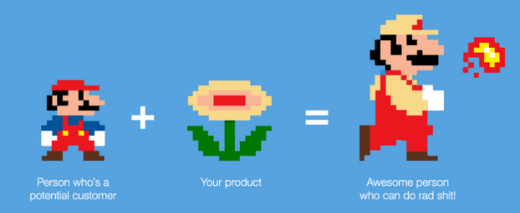

# Tech & Product Management

**Legend:** 🐾 Pattern, 💡 Realization, 😺 Meme, 🔭 Tool, 📚 Article/Book

🐾 Avoid writing software wherever possible. It's tantalizing for the entire organization, distracting, expensive, hard to maintain and harder to change. - myself

📚 Managers' schedules vs. makers' schedules and the cost of meetings: [Brilliant article by Paul Graham](http://www.paulgraham.com/makersschedule.html).

💡Outsourcing companies / agencies have a "The client is always right" mindset, while product companies need teams that own the product and fight over it.

🐾 Rubber duck debugging: Explain a problem to a hypothetical rubber duck to structure your own thoughts and come to a much better understanding or find solutions. - [The Pragmatic Programmer](https://en.wikipedia.org/wiki/Rubber_duck_debugging)

💡 A reason to distinguish between the terms "developer" and "engineer" is to point out that the goal of an engineer is not to write code but to solve a problem, ideally with as little code as possible. - [Renn Vara](https://snpnet.com/)

:bulb: For some years, I have been successfully using the following rule of thumb for scheduling a software task: 33% planning, 16% coding, 25% component test and early system test, 25% system test, all components in hand. - Fred Brooks, the Mythical Man-Month

### Product Discovery & Requirements Engineering

🐾 MVP thinking: Question all assumptions about customer need - unknown

🐾 Value management: Challenge safe assumptions regularly, don't wait for external triggers. Things are easily overlooked - Alexander

📚 [How to scale a magical experience](https://reid.medium.com/how-to-scale-a-magical-experience-4-lessons-from-airbnbs-brian-chesky-eca0a182f3e3). Reid Hoffmann interviews Airbnb's Brian Chesky who shares inspiring approaches to discovering, building and scaling truly customer-centric experiences.
